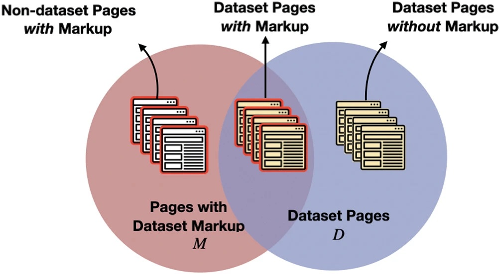
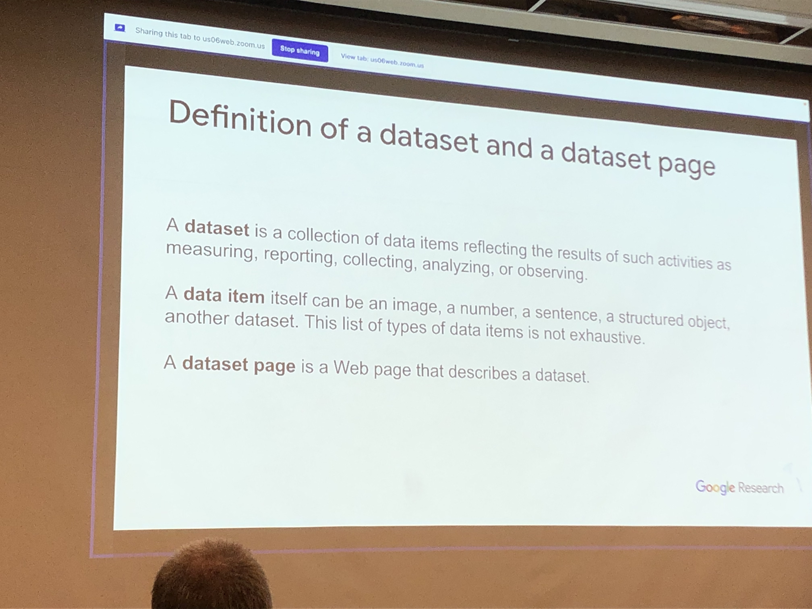
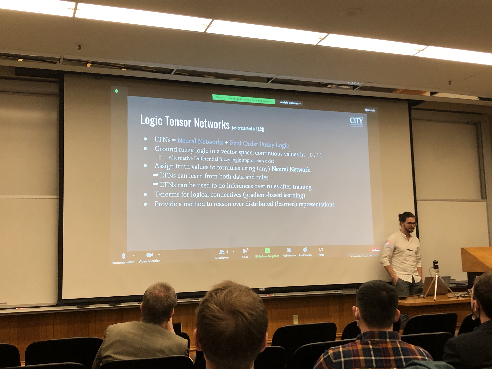
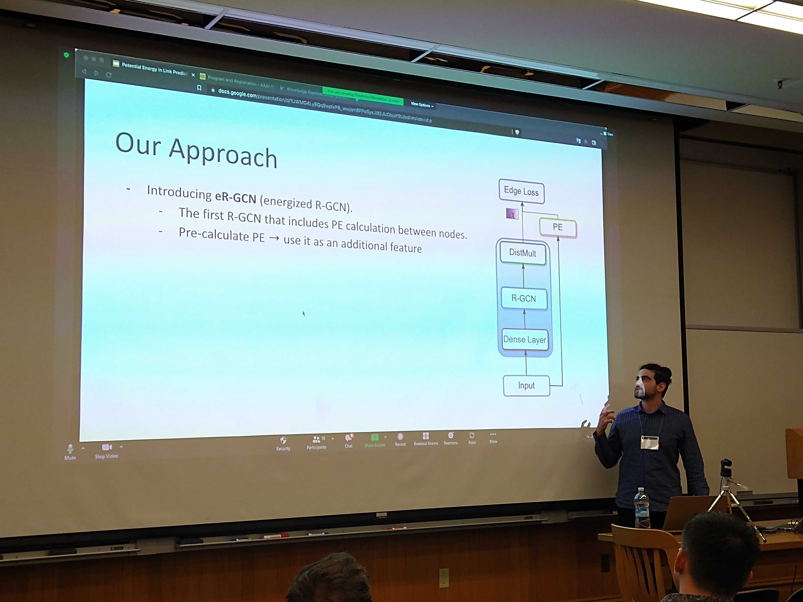

# AAAI-MAKE Trip Report  
March 21–23, 2022 @ Stanford University, Palo Alto, California, USA  
  
_Sponsored by the Association for the Advancement of Artificial Intelligence_  
  
[AAAI-MAKE](https://www.aaai-make.info/)  
  
  
### Prelude  
  
---  
After 2.5 years of limited social interaction I participated and presented a paper in the AAAI-MAKE Spring Symposium series. It was hosted in the History Building of Stanford University. For those who have never been to Stanford before (myself included), it is characterized by an impressive, inspiring and beautiful campus. In terms of facilities, space and things to do it comes second to no other university/campus I've ever been. A close competitor would be the University of British Columbia (UBC) in Vancouver Canada. But let's get to the interesting stuff of this report...   
  
If more people show interest in the process of visa (ESTA), booking flights/hotels etc for a remote conference, I can do another right-up on how to go about it.   
  
  
Now to the fun part!!  
  
### General info  
  
***  
The event was characterized by a variety of research topics with the general theme of being **hybrid**. Hybrid as in: reflecting on how can we combine ML approaches with KE (Knowledge Engineering) in order to build **hybrid intelligence systems**. It's worth noting that the event itself was hybrid (as in participants who couldn't make it in person, had the ability to join and present via Zoom). Which imho is nice and inclusive.  
  
There was in total 9 Symposia with a variety of topics. I list them here with links to their respective websites and I would recommend folks to check them out. Some of them were so interesting I wish I could be in 2 places at the same time.  
  
The full list:  
- [AI Engineering: Creating Scalable, Human-Centered and Robust AI Systems (Fully Virtual)](https://aaai.org/Symposia/Spring/sss22symposia.php#ss01)  
- [Artificial Intelligence for Synthetic Biology (Fully Virtual)](https://aaai.org/Symposia/Spring/sss22symposia.php#ss02)  
- [Can We Talk? How to Design Multi-Agent Systems in the Absence of Reliable Communications (In Person *)](https://aaai.org/Symposia/Spring/sss22symposia.php#ss03)  
- [Closing the Assessment Loop: Communicating Proficiency and Intent in Human-Robot Teaming (In Person *)](https://aaai.org/Symposia/Spring/sss22symposia.php#ss04)  
- [Designing Artificial Intelligence for Open Worlds (Fully Virtual)](https://aaai.org/Symposia/Spring/sss22symposia.php#ss05)  
- [Ethical Computing: Metrics for Measuring AI’s Proficiency and Competency for Ethical Reasoning (Fully Virtual)](https://aaai.org/Symposia/Spring/sss22symposia.php#ss06)  
- [How Fair is Fair? Achieving Wellbeing AI (In Person *)](https://aaai.org/Symposia/Spring/sss22symposia.php#ss07)  
- [Machine Learning and Knowledge Engineering for Hybrid Intelligence (In Person *)](https://aaai.org/Symposia/Spring/sss22symposia.php#ss08)  
- [Putting AI in the Critical Loop: Assured Trust and Autonomy in Human-Machine Teams (Fully Virtual)](https://aaai.org/Symposia/Spring/sss22symposia.php#ss09)  
  
I joined + followed the -   [Machine Learning and Knowledge Engineering for Hybrid Intelligence](https://aaai.org/Symposia/Spring/sss22symposia.php#ss08). So most of this report will be about that.  
  
  
#### Day 1  
***  
  
The first day started with a keynote by [Natasha Noy](https://research.google/people/NatalyaNoy/), who is leading the Dataset Search team at Google. For those who are unaware of Google Dataset Search, I would urge you to check it out. It's basically a search engine for well.... datasets. Datasets from governments, from the industry or for research and anything that can be crawled out of the web. (@Xu)  
  
One of the main points across was that, despite the absolute usefulness of declarative semantics, it appears that human-generated knowledge suffers from **low quality**. Which overall kinda contradicts the *hybrid* paradigm where ML pipelines are the usual suspect for low-quality while the human input is *glorified as high quality*.  
  
The example Natasha gave to support her claim was from an experiment they performed where they took 600M webpages that had the [schema.org](https://schema.org/) tag for "Dataset". For those who haven't heard of schema.org, it's an effort by Google, Microsoft, Yahoo and Yandex to attach semantics (in the form of mark-up) to webpages with the use of vocabularies. The incentive for websites? If you do it right, Google will pick it up and index it properly. For more info [schema.org faq](https://schema.org/docs/faq.html#:~:text=Schema.org%20is%20simply%20a,search%20engines%20%2D%20might%20later%20join.)  
  
Now back to the experiment....  
Out of 600M pages that had the markup "Dataset", a crazy 84% of them were false positives. Can the reader guess why?... Well, it's cause humans also apparently understand what a Dataset is (semantically) differently.   
  
%% Some related figures from her presentation:  
%%  

) 
  

 

What does that experiment tell us?  
- I guess it's not easy to crawl the web for datasets... when we cannot agree on what a Dataset is.  
- Schema.org labels are useful, but not when used in the **wrong way** by humans.  
  
  
  
**Session 1 in bullet points**  
  
 - [Neural-Symbolic Reasoning under Open-World and Closed-World Assumptions](https://proceedings.aaai-make.info/AAAI-MAKE-PROCEEDINGS-2022/paper3.pdf) (@Emile)  
      - Neural symbolic integration  
      - LTNs (Logic Tensor Networks)   
      - The task was subclass inference via (ontology) reasoning  
   - contact:  [Benedikt.wagner@city.ac.uk](mailto:Benedikt.wagner@city.ac.uk)  
   
 

- [A Framework for Context-dependent Augmented Reality Applications Using Machine Learning and Ontological Reasoning](https://proceedings.aaai-make.info/AAAI-MAKE-PROCEEDINGS-2022/paper11.pdf)  
   - ML for Augmented Reality + Ontological info (Fabian)  
      - Interesting work -- they connected with us in their search of a larger ontology they can use to test the overhead of real-time inferencing in their AR application.  
  
_Post session 1 thoughts_:   
There seems to be a common understanding that Hybrid Intelligence approaches are not only applicable but also preferable for multiple problems, especially problems characterized by lack of complete information. From Neural-Symbolic approaches for ontological subclass reasoning to Farming and Augmented Reality.  
  
**Session 2 in bullet points**  
  
General vibe: “Human in the loop”  
- [Combining Machine Learning with Human Knowledge for Delivery Time Estimations](https://proceedings.aaai-make.info/AAAI-MAKE-PROCEEDINGS-2022/paper7.pdf)  
   - Relevant for the industry... It was interesting to learn about the effect COVID had on supply chains.  
  
- [Combining Learning from Human Feedback and Knowledge Engineering to Solve Hierarchical Tasks in Minecraft](https://proceedings.aaai-make.info/AAAI-MAKE-PROCEEDINGS-2022/paper1.pdf)  
   - [David Watkins](https://davidwatkinsvalls.com/). Brilliant guy, easy to talk to. Mostly into RL and Robotics. (@Tae)  
   - their work was awarded as the most human-like agent in the 2021 Neural Information Processing Systems (NeurIPS) MineRL Benchmark for Agents that Solve Almost-Lifelike Tasks (BASALT) competition. Nuff said ;)  
   - I would suggest to take a look at their paper - feels like an interesting take on what *hybrid approaches can look like*   
- [A Hybrid Intelligent Approach for the Support of Higher Education Students in Literature Discovery](https://proceedings.aaai-make.info/AAAI-MAKE-PROCEEDINGS-2022/paper13.pdf)  
   - Quite a relevant presentation (for our work @The Discovery Lab) was regarding an [HI approach for support of higher education students in Literature Discovery](https://proceedings.aaai-make.info/AAAI-MAKE-PROCEEDINGS-2022/paper13.pdf). Their paper introduces an interesting approach that combines KG's, ML and the human input to recommend relevant papers to read.  
   - Although their truth corpus was small (42 papers) their approach to evaluation makes sense (and is hybrid..).   
   - Last but not least, both Ryan and his supervisor Emanuelle are really cool!  
  
**Session 3 in bullet points**  
  
- [SFMGNet: A Physics-based Neural Network To Predict Pedestrian Trajectories](https://proceedings.aaai-make.info/AAAI-MAKE-PROCEEDINGS-2022/paper14.pdf)  
   - The only other paper that used Physics inspired knowledge to enhance a prediction task.  
   - Useful for our colleagues at the CIVIC AI Lab (maybe?)  
  
  
- [Adjoined Networks: A training paradigm with applications to network compression](https://proceedings.aaai-make.info/AAAI-MAKE-PROCEEDINGS-2022/paper12.pdf) (@Michael, @Daniel - This has obvious applications to CNNs... I wonder what would happen if we tried to apply it to GNNs instead)  
   - Interesting idea to compress deep neural networks for the purpose of utilising them in production and edge devices.  
   - Based on the idea of *teacher* and *student* NNs.    
   - They introduce an *Adjoined Network* that trains a smaller compressed network alongside the original network.  
   - They show that they can simultaneously compress (with the student network) and regularize (the teacher network) *any architecture*.  
     
     
- [KARaML: Integrating Knowledge-Based and Machine Learning Approaches to Solve the Winograd Schema Challenge](https://proceedings.aaai-make.info/AAAI-MAKE-PROCEEDINGS-2022/paper9.pdf) (@Jan Christoph)  
   - Generally cool folks from the UK  
   - Their work employed semantic roles to help solve the Winograd Schema Challenge (or WSC), a commonsense reasoning task.  
   - Their work shows a lot of promise although limited in terms of which part of the WSC data set they chose as their test set.  
  
#### Day 1 after thoughts:  
- The other symposia were also extremely interesting for AI researchers, they touched upon philosophy - the example of morality vs ethics - but also human-robot collaboration in teams and trust.  
- Creating **design patterns** for ML was a well perceived idea by the community, as in the past the community has put together best-practices and design patters for software or knowledge engineering.  
- Lots of discussion around how do we go neuro-symbolic with Logic Tensor Networks making an appearance on Day 1 as one of the ways. (@Emile)  
  
  
  
#### Day 2  
  
***  
  
Day 2 started strong.  
  
The first session of the day had everything... From combining contrastive visual and language embeddings for visual relationship detection (@Tae), to code-mixed language (Code-mixed language is a form of language wherein syntactic elements from one language are inserted into another language in such a way that the semantics of the resultant language remains the same)   
  
Some highlights:  
  
- [Contrastive Visual and Language Translational Embeddings for Visual Relationship Detection](https://proceedings.aaai-make.info/AAAI-MAKE-PROCEEDINGS-2022/short1.pdf) (@Tae)  
   - Interesting combination of Visual-Spatial and LM embeddings for scene graph embeddings that preserve local structures of the graph.   
   - They evaluate on predicate detection and tail entity prediction.  
   - They also include a *time element* (maybe even more interesting for Tae)  
  
- [Learning Rules with Attributes and Relations in Knowledge Graphs](https://proceedings.aaai-make.info/AAAI-MAKE-PROCEEDINGS-2022/paper10.pdf) (@Michael, @Daniel)  
   - Interesting concept of looking at attributs in KGs as unary facts (e.g. (Joe Biden, Male) can be seen as gender_male(Joe Biden)) and then havin these unary facts expressed as self-loops in the graph (gender_Male(Joe Biden, Joe Biden)) so that they can be directly processed by *rule learners*  
 - They evaluate the quality of learned rules by doing Link Prediction.  
  
  
- [Robots with Commonsense: Improving Object Recognition through Size and Spatial Awareness](https://proceedings.aaai-make.info/AAAI-MAKE-PROCEEDINGS-2022/paper4.pdf) (@Selene)  
   - Although quite different from conversational emboddied agents, perhaps some ideas could be applied for Leolani  
  
  
- [Hybrid AI system delivering highly targeted news to business professionals](https://proceedings.aaai-make.info/AAAI-MAKE-PROCEEDINGS-2022/paper17.pdf)  
   - Interesting work by a start-up.  
   - Presented by the CEO -- cause his principal researcher got COVID (or something)  
   - As an idea, it packs some heat. If it actually works well it has the potential to "break or make" stuff. For more, I'd suggest you read the paper.  
  
  
  
** Post Day 2 **  
We had the plenary session where all the participants of every symposium joined. It was really cool and interesting to see the implicit connections between topics as well as the diversity of researchers + disciplines involved.  
        
  
#### Day 3  
  
***  
  
Short paper session: characterized by early-works but quite interesting as ideas.    
  
  
- [Commonsense Reasoning for Identifying and Understanding the Implicit Need of Help and Synthesizing Assistive Actions](https://proceedings.aaai-make.info/AAAI-MAKE-PROCEEDINGS-2022/short6.pdf) (@Selene, @Tae)  
   - I think this work is also relevant to yours.  
     
  
**Disclaimer**  
As I was the last presenter - the real headliner of the thing :P , I couldn't pay a lot of attention to the last days papers. Also, not a lot of notes from that day.  
  
### Last but not least, yours trully representing the VU :D) 
  
) 
  
  
### Random Notes

- Post event the organisers held a pretty horizontal meeting where they asked the participants how to make the event better. I found this brilliant, since it really helps in aligning what the researchers want with what the event can be about.
	-    For future iterations of MAKE:  including the design patterns / best practices to combine KR/E and ML as part of the submission. -> find patterns of hybrid systems (bottom-up boxology)
-   Interesting 3rd day comment was that combining KE with ML actually **sped up** the process of reaching a good POC, ready to be evaluated.” ( personally I would think the overhead of combining them correctly would **slow things** down but well…. That’s why it was interesting.
- I seriously liked California, I think I will pursue a position there for an internship for like 6 months - 1 year. A bit pricey but oh well...
	- The food was fantastic (american portions + asian cuisine <3 )
- A shoutout to Takashi Kido - he gave by far the funniest talk during the plenary session :D :D 
- It was the first time I met Greek colleagues from the NTUA in the US - if I was a classifier my job would be easy ( 3/4 had long hair + beard lol )
  
---  
  
## The end.